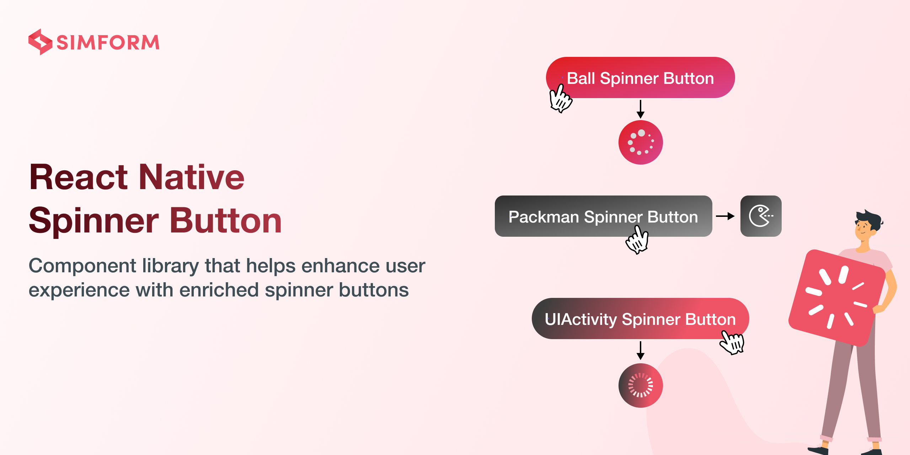
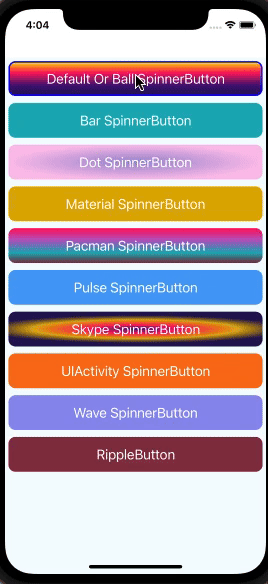
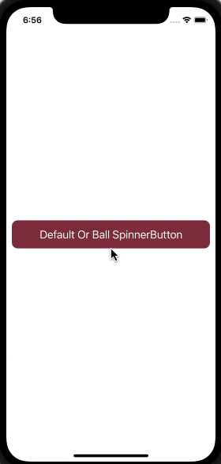
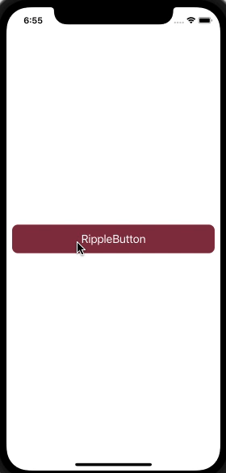

# react-native-spinner-button [](https://badge.fury.io/js/react-native-spinner-button) [](https://www.android.com) [](https://developer.apple.com/ios) [](https://opensource.org/licenses/MIT)
React Native Spinner Button component library provides dynamic spinner buttons and ripple effects, enriching the user experience with smooth animations and intuitive feedback
 
Library is compatible with both Android and iOS platforms, offering a versatile solution to elevate your app's user interface with ease.

## 🎬 Preview



## Quick Access

[Installation](#installation) | [Usage and Examples](#usage) | [Properties](#properties) | [Example Code](#example) | [License](#license)

## Getting Started

Here's how to get started with react-native-spinner-button in your React Native project:

### Installation

#### 1. Install the package

```sh
npm install react-native-spinner-button react-native-gradients react-native-svg
```

Using `Yarn`:

```sh
yarn add react-native-spinner-button react-native-gradients react-native-svg
```

##### 2. Install cocoapods in the ios project

```bash
cd ios && pod install
```


##### Know more about [react-native-gradients](https://www.npmjs.com/package/react-native-gradients) and [react-native-svg](https://www.npmjs.com/package/react-native-svg)


## Usage

```jsx
import React, {useState, useCallback} from 'react';
import {StyleSheet, Text, View} from 'react-native';
import SpinnerButton from 'react-native-spinner-button';

const App: React.FC = () => {
  const [isLoading, setLoading] = useState<boolean>(false);

  const handleButtonPress = useCallback<() => void>(() => {
    setLoading(true);
    setTimeout(() => {
      setLoading(false);
    }, 3000);
  }, []);

  return (
    <View style={styles.screen}>
      {/* Your button component */}
      <SpinnerButton
        buttonStyle={styles.buttonStyle}
        isLoading={isLoading}
        onPress={() => {
          handleButtonPress();
        }}
        indicatorCount={10}
      >
        <Text style={styles.buttonText}>Default Or Ball SpinnerButton</Text>
      </SpinnerButton>
    </View>
  );
};

export default App;

const styles = StyleSheet.create({
  screen: {
    flex: 1,
    justifyContent: 'center',
    alignItems: 'center',
  },
  buttonStyle: {
    borderRadius: 10,
    margin: 10,
    backgroundColor: '#893346',
  },
  buttonText: {
    fontSize: 20,
    textAlign: 'center',
    color: 'white',
  },
});
```


Example of Ripple Effect Button

```jsx
import React from 'react';
import {StyleSheet, Text, View} from 'react-native';
import SpinnerButton from 'react-native-spinner-button';

const App: React.FC = () => {
  const buttonPress: () => void = () => {
    console.log('Button Clicked');
  };

  return (
    <View style={styles.screen}>
      <SpinnerButton
        animationType="ripple-effect"
        onPress={buttonPress}
        buttonStyle={styles.btnStyle}
        animatedDuration={400}>
        <Text style={styles.textStyle}>RippleButton</Text>
      </SpinnerButton>
    </View>
  );
};

const styles = StyleSheet.create({
  screen: {
    flex: 1,
    justifyContent: 'center',
  },
  btnStyle: {
    margin: 10,
    backgroundColor: '#893346',
  },
  textStyle: {
    fontSize: 20,
    textAlign: 'center',
    color: 'white',
  },
});

export default App;
```


#### 🎬 Preview

|       Spinner Button    |  Ripple Button    |
| :-------: | :-----:|
|    |       |


## Properties

Props for the spinner button

| Props                 | Default |          Type           | Description                                                                                          |
| :-------------------- | :-----: | :---------------------: | :--------------------------------------------------------------------------------------------------- |
| **onPress** |    -    |   function  | The function to execute upon tapping the button |
| animationType |    null or undefined    |         string          | Type of animation for the button and spinner, For more details about properties, refer [react-native-animatable](https://www.npmjs.com/package/react-native-animatable) and also support "ripple-effect"  |
| buttonStyle |   {height: 50}    | array or object | Button styling |
| borderStyle |    -    |       array or object        | It's a stylesheet object supporting all basic border properties like width, radius, color, and style (solid, dotted, and dashed), etc |
| spinnerColor |  white   |  string  | The color of the spinner |
| spinnerType  |  BallIndicator   |  string  | Type of the spinner: BallIndicator, BarIndicator, DotIndicator, MaterialIndicator, PacmanIndicator, PulseIndicator, SkypeIndicator, UIActivityIndicator, WaveIndicator. |
| isLoading |  false   |  boolean  | The flag to render a button or a spinner. false will render a button, and true will render a spinner  |
| indicatorCount     |    8    |   number   | The count property of react-native-indicators |
| size |    16    |   number   |  The size of the dot in DotIndicator  |
| spinnerOptions |    -    | object  | An object of waveMode for WaveIndicator. For more details about these properties, refer [react-native-indicators](https://github.com/n4kz/react-native-indicators) |
| gradientType |    -    |   string   | Gradients allow you to display more than one color with a smooth transition between the colors (think Instagram logo). Currently, we support two types of gradients: linear and radial |
| gradientColors  |    -    |   array   | Colors can be passed in different formats such as name, RGBA, hex, etc. The colors should be ordered in the way we want them to be displayed. For example, colors={[ "purple", "white" ]}, the gradient will transition from purple to white |
| gradientColoroffset |    -    |   array   | An array of strings that defines where each color will stop in the gradient. These values are passed as a percentage of the entire gradient from 0% to 100% and must correspond to the colors passed in length and position. For example, with colors={[“red”, “yellow”, “green”]}, then we’ll have locations={['0%', '50%', '80%']}, with the first color (red) covering '0%' – '50%', the second (yellow) going from '50%' – '80%', and the third (green) from '80%' – '100%' |
| gradientColorAngle |    -    |   number   | The gradient line's angle of direction. A value of 0deg is equivalent to the top; increasing values rotate clockwise from there. The angle range is from 0 to 360 degrees [More detail to read](https://www.quirksmode.org/css/images/angles.html) |
| gradientRadialRadius  |    -    |   number   | This property is used for radial type gradients to set the radius of the radial gradient   |
| gradientButtonHeight |    -    |   number   | The size of the gradient component |
| radialRadiusx |    -    |  string or number   | The x-coordinate of the center of the radial gradient
| radialRadiusy |    -    |    string or number   | The y-coordinate of the center of the radial gradient |
| radialRadiusRX  |    -    |    string or number   | The horizontal radius of the radial gradient defining the ellipse  |
| radialRadiusRY  |    -    |    string or number   | The vertical radius of the radial gradient defining the ellipse  |
| animatedDuration  |    300    |   number   | This property is used to define the duration of the animation, indicating how long it will take to execute the animation  |
| customSpinnerComponent  |    -    |   node   | This prop allows you to add your own custom spinner component  |
| animateWidth  |    -    |   number   | This prop is used to set the component width when the progress/loading starts. If you do not set this prop, it will identify the width and height which are minimum and then use that value  |
| animateHeight  |    -    |   number   | This prop is used to set the component height when the progress/loading starts. If you do not set this prop, it will identify the width and height which are minimum and then use that value   |
| animateRadius  |    -    |   number   | This prop is used to set the component radius when the progress/loading starts. If you do not set this prop, it will create a circle shape by default  |
| isConnected  |    true    |   boolean   | The flag is used to identify the network connection, and based on the flag, the user iteration is set. false will render the button in disabled mode, and true will render the button in normal mode  |
| disabled  |    false    |   boolean   | The flag to identify button enable/disable. true will render the button in disabled mode, and false will render the button in normal mode  |
| disableStyle  |    -    |   array or object   | It's a stylesheet object. This style applies when identifying the button as disabled or if network connection is not available  |
| gradientName  |    -    |   string   | These properties are used whenever you want to use a gradient but do not pass the gradientColors, gradientColorOffset, and gradientColorAngle properties |
| disableGradientColors  |    -    |   array   | Colors can be passed in different formats such as names, RGBA, hex, etc. The colors should be ordered in the way we want them to be displayed. For example, with colors={[ "purple", "white" ]}, the gradient will transition from purple to white  |
| rippleColor |   rgba(255, 255, 255, .25)    | string | Color of the ripple animation effect

## Example
  A full working example project is here [Example](./example/App/App.tsx)

  ```sh
yarn
yarn example ios   // For ios
yarn example android   // For Android
```


## Find this library useful? ❤️

Support it by joining [stargazers](https://github.com/SimformSolutionsPvtLtd/react-native-spinner-button/stargazers) for this repository.⭐

## Bugs / Feature requests / Feedbacks

For bugs, feature requests, and discussion please use [GitHub Issues](https://github.com/SimformSolutionsPvtLtd/react-native-spinner-button/issues/new?labels=bug&late=BUG_REPORT.md&title=%5BBUG%5D%3A), [GitHub New Feature](https://github.com/SimformSolutionsPvtLtd/react-native-spinner-button/issues/new?labels=enhancement&late=FEATURE_REQUEST.md&title=%5BFEATURE%5D%3A), [GitHub Feedback](https://github.com/SimformSolutionsPvtLtd/react-native-spinner-button/issues/new?labels=enhancement&late=FEATURE_REQUEST.md&title=%5BFEEDBACK%5D%3A)


## 🤝 How to Contribute

We'd love to have you improve this library or fix a problem 💪
Check out our [Contributing Guide](CONTRIBUTING.md) for ideas on contributing.

## Awesome Mobile Libraries

- Check out our other [available awesome mobile libraries](https://github.com/SimformSolutionsPvtLtd/Awesome-Mobile-Libraries)

## License

- [MIT License](./LICENSE)
