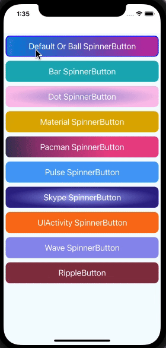

# react-native-spinner-button [](https://badge.fury.io/js/react-native-spinner-button) [](https://www.android.com) [](https://developer.apple.com/ios) [](https://opensource.org/licenses/MIT)
React Native Spinner Button component library provides dynamic spinner buttons and ripple effects, enriching the user experience with smooth animations and intuitive feedback
 
Library is compatible with both Android and iOS platforms, offering a versatile solution to elevate your app's user interface with ease.

## 🎬 Preview



## Quick Access

[Installation](#installation) | [Usage and Examples](#usage) | [Properties](#properties) | [Example Code](#example) | [License](#license)

## Getting Started

Here's how to get started with react-native-spinner-button in your React Native project:

### Installation

#### 1. Install the package

```sh
npm install react-native-spinner-button react-native-gradients react-native-svg
```

Using `Yarn`:

```sh
yarn add react-native-spinner-button react-native-gradients react-native-svg
```

##### 2. Install cocoapods in the ios project

```bash
cd ios && pod install
```


##### Know more about [react-native-gradients](https://www.npmjs.com/package/react-native-gradients) and [react-native-svg](https://www.npmjs.com/package/react-native-svg)


## Usage

```jsx
import React, {useState, useCallback} from 'react';
import {StyleSheet, Text, View} from 'react-native';
import SpinnerButton from 'react-native-spinner-button';

const App: React.FC = () => {
  const [isLoading, setLoading] = useState<boolean>(false);

  const handleButtonPress = useCallback<() => void>(() => {
    setLoading(true);
    setTimeout(() => {
      setLoading(false);
    }, 3000);
  }, []);

  return (
    <View style={styles.screen}>
      {/* Your button component */}
      <SpinnerButton
        buttonStyle={styles.buttonStyle}
        isLoading={isLoading}
        onPress={() => {
          handleButtonPress();
        }}
        indicatorCount={10}
      >
        <Text style={styles.buttonText}>Default Or Ball SpinnerButton</Text>
      </SpinnerButton>
    </View>
  );
};

export default App;

const styles = StyleSheet.create({
  screen: {
    flex: 1,
    justifyContent: 'center',
    alignItems: 'center',
  },
  buttonStyle: {
    borderRadius: 10,
    margin: 10,
    backgroundColor: '#893346',
  },
  buttonText: {
    fontSize: 20,
    textAlign: 'center',
    color: 'white',
  },
});
```


Example of Ripple Effect Button

```jsx
import React from 'react';
import {StyleSheet, Text, View} from 'react-native';
import {Button} from 'react-native-spinner-button';

const App: React.FC = () => {
  const buttonPress: () => void = () => {
    console.log('Button Clicked');
  };

  return (
    <View style={styles.screen}>
      <Button
        animationType="ripple-effect"
        onPress={buttonPress}
        style={styles.btnStyle}
        animatedDuration={400}>
        <Text style={styles.textStyle}>RippleButton</Text>
      </Button>
    </View>
  );
};

const styles = StyleSheet.create({
  screen: {
    flex: 1,
    justifyContent: 'center',
  },
  btnStyle: {
    margin: 10,
    backgroundColor: '#893346',
  },
  textStyle: {
    fontSize: 20,
    textAlign: 'center',
    color: 'white',
  },
});

export default App;
```


#### 🎬 Preview

|       Spinner Button    |  Ripple Button    |
| :-------: | :-----:|
|    |       |


## Properties

Props for Spinner Button

| Props                 | Default |          Type           | Description                                                                                          |
| :-------------------- | :-----: | :---------------------: | :--------------------------------------------------------------------------------------------------- |
| **onPress** |    -    |   function  | The function to execute on tap of the button |
| animationType |    null or undefined    |         string          | Type of animation for the button and spinner, For more details about properties, refer [react-native-animatable](https://www.npmjs.com/package/react-native-animatable)   |
| buttonStyle |   {height: 50}    | array or object | Styling of button |
| borderStyle |    -    |       array or object        | Its a stylesheet object with support all basic border property like width, radius, color and style(solid, dotted and dashed) etc |
| spinnerColor |  white   |  string  | The color of the Spinner |
| spinnerType  |  BallIndicator   |  string  | Type of the spinner (BallIndicator, BarIndicator, DotIndicator, MaterialIndicator, PacmanIndicator, PulseIndicator, SkypeIndicator, UIActivityIndicator, WaveIndicator) |
| isLoading |  false   |  boolean  | The flag to render a Button or a Spinner. false will render button and true will render spinner  |
| indicatorCount     |    8    |   number   | The count property of react-native-indicators |
| size |    16    |   number   |  The size of the Dot in DotIndicator  |
| spinnerOptions |    -    | object  | An object of waveMode for WaveIndicator for WaveIndicator. For more details about these properties, refer [react-native-indicators](https://github.com/n4kz/react-native-indicators) |
| gradientType |    -    |   string   | Gradients allow you to show more than one color with a smooth transition between the colors (think Instagram logo). Currently, we are supporting two types of gradient (linear, radial) |
| gradientColors  |    -    |   array   | Colors can be passed in a different format name, rgba, hex etc. The colors should be ordered the way we want them to be displayed. Eg. colors={[ “purple”, “white” ]} the gradient will move from purple to white |
| gradientColoroffset |    -    |   array   | An array of string that define where each color will stop in the gradient. These values are also passed as a percentage of the entire gradient from 0% – 100% and have to map the corresponding colors passed in length and position. For colors={[“red”, “yellow”, “green”}] then we’ll have locations={['0%', '50%', '80%']} with first color (red) covering '0%' – '50%', second (yellow) going from '50%' – '80%' and yellow '80%' – '100%' |
| gradientColorAngle |    -    |   number   | The gradient line's angle of direction. A value of 0deg is equivalent to to top; increasing values rotate clockwise from there. The angle range of 0 to 360. [More detail to read](https://www.quirksmode.org/css/images/angles.html) |
| gradientRadialRadius  |    -    |   number   | This property used for Radial type gradient in set radius of radial gradient   |
| gradientButtonHeight |    -    |   number   | The size of the gradient component |
| radialRadiusx |    -    |  string or number   | The x coordinate of the center of the radial gradient 
| radialRadiusy |    -    |    string or number   | The y coordinate of the center of the radial gradient |
| radialRadiusRX  |    -    |    string or number   | The horizontal radius of the radial gradient defining ellipse  |
| radialRadiusRY  |    -    |    string or number   | The vertical radius of the radial gradient defining ellipse  |
| animatedDuration  |    300    |   number   | Used for animation time, how long you have to execute your animation  |
| customSpinnerComponent  |    -    |   node   | This props will allow you to add your own custom spinner component  |
| animateWidth  |    -    |   number   | This props used to set component width when progress/loading will start. If you want to not set this props then identify width and height which is minimum and then used that value  |
| animateHeight  |    -    |   number   | This props used to set component height when progress/loading will start. If you want to not set this props then identify width and height which is minimum and then used that value   |
| animateRadius  |    -    |   number   | This props used to set component radius when progress/loading will start. If you want to not set this props then create circle shape  |
| isConnected  |    true    |   boolean   | The flag to identify network connection and based on flag set user iteration. false will render button with disable mode and true will render button with normal mode  |
| disabled  |    false    |   boolean   | The flag to identify button enable/disable. true will render button with disable mode and false will render button with normal mode  |
| disableStyle  |    -    |   array or object   | Its a stylesheet object. This style apply when identify button disable or if network connect not available  |
| gradientName  |    -    |   string   | This properties used whenever you want to need gradient but not pass gradientColors, gradientColoroffset and gradientColorAngle properties |
| disableGradientColors  |    -    |   array   | Colors can be passed in a different format name, rgba, hex etc. The colors should be ordered the way we want them to be displayed. Eg. colors={[ “purple”, “white” ]} the gradient will move from purple to white  |


Props for Button

| Props                 | Default |          Type           | Description                                                                                          |
| :-------------------- | :-----: | :---------------------: | :--------------------------------------------------------------------------------------------------- |
| **onPress** |    -    |   function  | The function to execute on tap of the button |
| style |    -    |         object          | Styling for button container   |
| animatedDuration |   500    | number | Duration of ripple animation effect |
| rippleColor |   rgba(255, 255, 255, .25)    | string | Color of ripple animation effect
| animationType  |  ripple-effect   |  string  | Type of the Animation (ripple-effect) 

## Example
  A full working example project is here [Example](./example/App/App.tsx)

  ```sh
yarn
yarn example ios   // For ios
yarn example android   // For Android
```


## Find this library useful? ❤️

Support it by joining [stargazers](https://github.com/SimformSolutionsPvtLtd/react-native-spinner-button/stargazers) for this repository.⭐

## Bugs / Feature requests / Feedbacks

For bugs, feature requests, and discussion please use [GitHub Issues](https://github.com/SimformSolutionsPvtLtd/react-native-spinner-button/issues/new?labels=bug&late=BUG_REPORT.md&title=%5BBUG%5D%3A), [GitHub New Feature](https://github.com/SimformSolutionsPvtLtd/react-native-spinner-button/issues/new?labels=enhancement&late=FEATURE_REQUEST.md&title=%5BFEATURE%5D%3A), [GitHub Feedback](https://github.com/SimformSolutionsPvtLtd/react-native-spinner-button/issues/new?labels=enhancement&late=FEATURE_REQUEST.md&title=%5BFEEDBACK%5D%3A)


## 🤝 How to Contribute

We'd love to have you improve this library or fix a problem 💪
Check out our [Contributing Guide](CONTRIBUTING.md) for ideas on contributing.

## Awesome Mobile Libraries

- Check out our other [available awesome mobile libraries](https://github.com/SimformSolutionsPvtLtd/Awesome-Mobile-Libraries)

## License

- [MIT License](./LICENSE)
